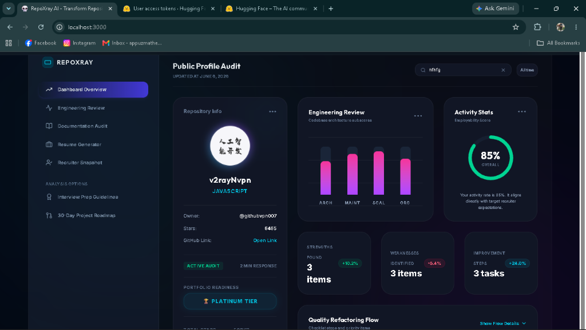
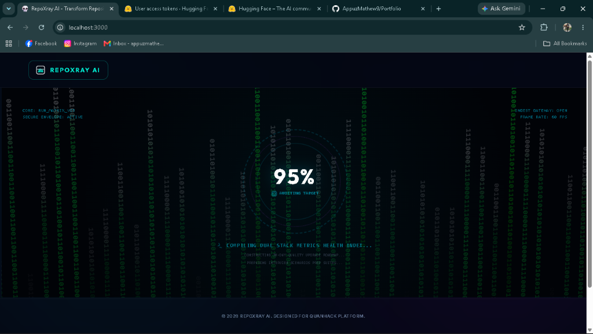

# RepoXray AI 🔭

> **AI-powered GitHub Repository Intelligence Platform**  
> Paste any public GitHub URL → get a full engineering audit, resume bullets, interview prep, and 30-day improvement roadmap in seconds.


## 📸 Screenshots



---

## 🎯 Project Overview

RepoXray AI connects to any public GitHub repository and uses a multi-provider LLM pipeline to generate a comprehensive 6-part intelligence report:

| Tab | Output |
|---|---|
| 📊 **Overview** | Employability score, stars/forks metadata, language breakdown |
| ⚙️ **Engineering Review** | Code quality score, architecture strengths & weaknesses |
| 📖 **Documentation Audit** | README quality score, missing sections, recommendations |
| 📄 **Resume Generator** | ATS-optimized bullet points with action verbs |
| 🎙️ **Interview Prep** | Custom interview questions with suggested talking points |
| 🗺️ **30-Day Roadmap** | Prioritized improvement tasks with timelines & outcomes |

---

## ✨ Features

- 🌍 **Interactive 3D Globe** — 500 live GitHub repos mapped to real-world locations; click any coordinate to audit it
- 🛸 **3D Responsive Parallax** — Interactive layout with multi-layered spring parallax translates background/globe elements relative to card layers.
- 🎬 **Cinematic Planetary Loader** — Custom CSS keyframe animation sequence on page load
- 🖥️ **JARVIS Matrix Boot Screen** — Full-screen terminal scanner with binary rain canvas that properly isolates stacking contexts to cover the entire viewport.
- 🔍 **Dynamic Stats Search** — A fully responsive dashboard search bar that filters counters and aggregates active matches dynamically.
- 🔄 **Multi-LLM & Hugging Face Pipeline** — Google Gemini → OpenRouter → Hugging Face (serverless LLaMA/Mistral/Phi-3) → Groq → Local LLMs.
- ⚡ **Single Consolidated Prompt** — One LLM call generates all 6 report sections simultaneously
- 🔒 **Timeout Protection** — 12s GitHub API + 20s LLM timeouts prevent infinite hangs

---

## 🏗️ Architecture Diagram



```
User → React Frontend (Vite, Port 3000)
              │
              │ POST /api/analyze
              ▼
    Express Backend (Port 5000)
              │
       ┌──────┴──────┐
       │  GitHub API  │  ← repo metadata, README, file tree, source files
       └──────┬──────┘
              │
       ┌──────▼──────┐
       │ Prompt Build │  ← consolidated-analysis.txt template injection
       └──────┬──────┘
              │
    ┌─────────▼──────────┐
    │   LLM Failover      │
    │ 1. Gemini 1.5 Flash │
    │ 2. OpenRouter       │
    │ 3. Groq LLaMA 3.3   │
    └─────────┬──────────┘
              │
       Structured JSON Report (6 sections)
              │
              ▼
    React Dashboard (6 tabbed views)
```

---

## 🚀 Installation Guide

### Prerequisites

- Node.js 18+
- GitHub Personal Access Token
- Google Gemini API Key (free tier works)

### 1. Clone the repository

```bash
git clone https://github.com/YOUR_USERNAME/repoxray-ai.git
cd repoxray-ai
```

### 2. Install frontend dependencies

```bash
npm install
```

### 3. Install backend dependencies

```bash
cd server
npm install
cd ..
```

### 4. Configure environment variables

Create `server/.env`:

```env
PORT=5000
GEMINI_API_KEY=your_gemini_api_key_here
GITHUB_TOKEN=your_github_token_here
OPENROUTER_API_KEY=your_openrouter_key_here   # optional fallback
HUGGING_FACE_API=your_huggingface_key_here     # optional fallback (serverless LLM API)
GROQ_API_KEY=your_groq_key_here               # optional fallback
```

### 5. Start both servers

**Terminal 1 — Backend:**
```bash
cd server
npm run dev
```

**Terminal 2 — Frontend:**
```bash
npm run dev
```

Open [http://localhost:3000](http://localhost:3000)

---

## 🎮 Usage Instructions

1. **Wait for the planetary loading animation** to complete (8 seconds — 2 orbit cycles)
2. **Browse the 3D globe** — 500 real GitHub repositories are mapped as glowing coordinate points
3. **Click any point** to instantly audit that repository, OR
4. **Paste a GitHub URL** in the input field and click the arrow
5. **Watch the JARVIS terminal scan** — real-time progress with binary log messages
6. **Explore your 6-tab report** — engineering, docs, resume, interview, roadmap

---

## 📁 Project Structure

```
repoxray-ai/
├── src/
│   ├── components/
│   │   ├── DashboardOverview.tsx     # Main score overview
│   │   ├── EngineeringReview.tsx     # Code quality analysis
│   │   ├── DocumentationAudit.tsx    # README scoring
│   │   ├── ResumeGenerator.tsx       # ATS bullet points
│   │   ├── InterviewPrep.tsx         # Interview questions
│   │   ├── ImprovementRoadmap.tsx    # 30-day task roadmap
│   │   └── SpaceParticles.tsx        # Ambient particle background
│   ├── App.tsx                       # Main app, globe, scanner logic
│   ├── index.css                     # Custom animations & global styles
│   └── types.ts                      # TypeScript interfaces
├── server/
│   ├── server.js                     # Express API + LLM failover
│   └── prompts/
│       └── consolidated-analysis.txt # Master LLM prompt template
├── SYSTEM_DESIGN.md                  # Architecture & design doc
└── README.md
```

---

## 🔑 API Keys Setup

| Key | Where to Get | Required? |
|---|---|---|
| `GEMINI_API_KEY` | [Google AI Studio](https://aistudio.google.com) | ✅ Primary |
| `GITHUB_TOKEN` | [GitHub Settings → Tokens](https://github.com/settings/tokens) | ✅ Required |
| `OPENROUTER_API_KEY` | [OpenRouter.ai](https://openrouter.ai) | ⚡ Fallback |
| `HUGGING_FACE_API` | [Hugging Face Settings](https://huggingface.co/settings/tokens) | ⚡ Fallback |
| `GROQ_API_KEY` | [Groq Console](https://console.groq.com) | ⚡ Fallback |

---

## 🛠️ Tech Stack

**Frontend**
- React 18 + TypeScript
- Vite (dev server + proxy)
- Tailwind CSS + Custom CSS Animations
- amCharts 5 (3D Globe)
- Lucide React (icons)

**Backend**
- Node.js + Express
- @google/generative-ai SDK
- Axios (GitHub API + failover LLMs)
- dotenv

**AI / LLM**
- Google Gemini 1.5 Flash (primary)
- OpenRouter — Gemini 2.5 Flash Free (fallback 1)
- Hugging Face Inference API — LLaMA 3.2, LLaMA 3, Mistral, Phi-3 (fallback 2, remote serverless open-source LLMs)
- Groq — LLaMA 3.3 70B Versatile (fallback 3)

---

## 📋 System Design

See [SYSTEM_DESIGN.md](./SYSTEM_DESIGN.md) for the full architecture write-up covering:
- Data flow diagram
- Prompt engineering decisions
- LLM failover strategy
- Key trade-offs considered

---

## 🔌 API Documentation

RepoXray AI backend exposes standard REST API endpoints. All error responses are formatted as standardized RFC 7807/Boom JSON payloads.

### 1. Health Status
- **Endpoint:** `GET /api/health`
- **Description:** Verifies connectivity and retrieves backend state.
- **Response Format:**
  ```json
  {
    "status": "ok",
    "timestamp": "2026-06-07T00:15:00.000Z",
    "port": 5000
  }
  ```

### 2. Analyze Repository
- **Endpoint:** `POST /api/analyze`
- **Payload:** `{ "url": "https://github.com/owner/repo" }`
- **Description:** Scans file structure and fetches key files for LLM analysis.
- **Headers:** Includes optional `x-request-id` header for log correlation.

### 3. Generate README
- **Endpoint:** `POST /api/generate-readme`
- **Payload:** `{ "url": "https://github.com/owner/repo" }`
- **Description:** Uses the LLM failover pipeline to output a markdown README template.

### 4. Globe Repositories Discovery
- **Endpoint:** `GET /api/globe-repos`
- **Description:** Retrieves 500 geolocation-mapped repositories (25% owned, 75% popular public) for the 3D globe visualization.

---

## 🤝 Contribution Guidelines

We welcome contributions to RepoXray AI! To get started:
1. **Fork the repository** on GitHub.
2. **Create a feature branch:** `git checkout -b feature/amazing-feature`.
3. **Write tests** for any new utility helper functions under the `server/test` directory.
4. **Ensure tests pass:** Run `npm test` inside the `server/` directory.
5. **Commit your changes:** Follow descriptive clean-commit messages.
6. **Push and Open a Pull Request.**

---

## 🔧 Troubleshooting

If you encounter issues during installation or setup:
- **Port 5000 Already in Use:** Kill the process running on port 5000 or set a custom `PORT` in your environment files.
  - Windows command to release port: `netstat -ano | findstr :5000` followed by `taskkill /PID <PID> /F`.
- **Axios Rate Limits / 403 Forbidden:** Provide a valid `GITHUB_TOKEN` in your `server/.env` to increase query rate limits to 5000 req/hr.
- **Fail to Fetch Errors:** Verify the backend Express server on port 5000 is active.

---

## 🛡️ Security

We prioritize security:
- **API Keys Safety:** Never check in your `server/.env` or API credentials to GitHub. Always use standard environment variables.
- **Input Sanitization:** All user-provided repository URLs are parsed using strict regex validation to prevent malicious injection.

---

## 📋 Changelog

- **v1.2.0**: Refactored monolithic server layout into modular ES Module helper sub-services (`github.js`, `llm.js`, `geoip.js`, `logger.js`, `middleware.js`) and added integration test suites.
- **v1.1.0**: Standardized structured logging with Winston and request correlation context.
- **v1.0.0**: Initial release featuring Globe visualization and consolidated analysis templates pass.

---

## 📄 License

MIT License — see [LICENSE](LICENSE) for details.

---

*Built for the QuAnHack AI Workflow Challenge — June 2026*
